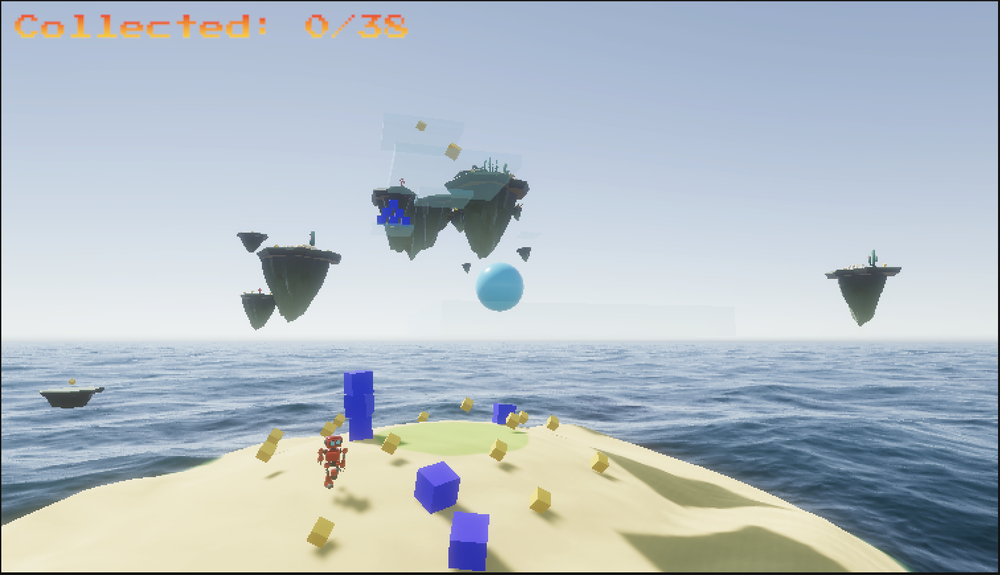

# Sphere Quest 3D




## Overview

Sphere Quest 3D is a 3D platformer taking inspiration from classic games like Super Mario and Sonic. Your goal is to navigate the 3D environment, collect cubes, and avoid robots. The game is set on a tropical island, surrounded by floating islands and moving platforms. Our goal was to capture the energy and aesthetic of the aforementioned 3D platformers.

## Project Layout

```
Assets
├── Animation -> All game animations
├── Audio -> All game audio files
├── Fonts -> Fonts used in UI
├── FreeLowPolyRobot -> Enemy robot asset
├── Input -> Input mappings
├── LowPolyTropicalEnvironment_LITE -> Tropical island asset
├── Materials -> All game materials
├── Prefabs -> All game prefabs
├── Scenes -> All game scenes
├── Scripts -> All game scripts
│   ├── CameraController.cs -> Controls the camera
│   ├── DifficultyController.cs -> Adjusts game difficulty
│   ├── EnemyMovement.cs -> Allows enemies to track the player
│   ├── GameManager.cs -> Controls the game state
│   ├── PlayerController.cs -> Controls player state & movement
│   ├── Rotator.cs -> Controls pick-up rotation
│   └── VolumeController.cs -> Adjusts music & SFX volume
├── Settings
├── Shaders
└── Unvik_3D
```